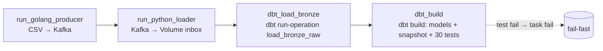

# E-Commerce Cosmetics — Data Engineering Platform


End-to-end **Data Engineering & Analytics** platform cho nền tảng e-commerce mỹ phẩm lưu lượng cao.
Một streaming engine tự build (**Go + Kafka**) mô phỏng backend thật, ingest **>12 triệu event logs**
qua **Medallion Architecture** trên Databricks (Bronze → Silver → Gold) bằng **dbt** chạy trên
**Serverless SQL Warehouse**, có **Data Quality gate fail-fast**, orchestration bằng **Airflow**,
observability bằng **Prometheus/Grafana**, và dashboard **Power BI**.

---

## Business impacts & insights

- **Bot & Spam Mitigation** — dynamic blacklisting (left_anti join) cô lập bot traffic
  (>100 event/session) và spam sessions (>50 cart, 0 view, 0 purchase) ở Silver→ dữ liệu tài chính sạch.
- **Funnel Optimization** — phát hiện rò rỉ doanh thu ở checkout; root cause là shipping cost cao
  so với AOV (~$12) → đề xuất chiến lược "Freeship" theo ngưỡng.
- **B2B Wholesale Discovery (RFM)** — phân khúc RFM phát hiện cluster "VIP" wholesale buyers
  (Spa & Salon) với view-to-order rate cao → đề xuất B2B portal + telesales.

---

## Data flow


### Orchestration — Airflow DAG `cosmetics_medallion`



- `schedule = */5 * * * *`, `catchup=False`, `max_active_runs=1`, `retries=1`, `on_failure_callback`
- Mỗi task là `BashOperator`. dbt chạy trong venv riêng (`/opt/airflow/dbt_venv/bin/dbt`) tách biệt khỏi deps Airflow.

---

## Architecture components

### Streaming engine (`Go` + `Kafka`)

- **Go producer** (`local_streaming_engine/producer/main.go`): đọc CSV lịch sử → đẩy JSON lên topic
  `ecommerce_events`, **key = `user_id`** (cùng user → cùng partition). Batched **100k event/run**,
  flush Kafka mỗi 500 message, **checkpoint file** (`producer_offset.txt`) để resume.
  Binary build bằng Dockerfile multi-stage (distroless runtime — không commit binary), **8 unit test**.
- **Kafka cluster KRaft 3 broker** (docker-compose), **min ISR = 2** → toàn vẹn dữ liệu khi 1 broker down

### Ingestion vào lakehouse (`Python` + `Databricks SDK`)

- **Loader** (`airflow/dags/scripts/kafka_to_bronze_loader.py`): Kafka consumer **tắt auto-commit**,
  chỉ `consumer.commit()` **sau khi** upload file JSON lên Volume thành công → **exact-once**.
  Defense-in-depth: skip row thiếu `user_id`/`product_id` trước khi đẩy.

### Medallion pipeline (`dbt` + `Databricks SQL Warehouse` + `Delta`)

Chạy trên **Serverless SQL Warehouse** (auto-start, không cần all-purpose cluster — Community Edition).
Project dbt ở `databricks_processing/dbt/`, catalog `workspace` (Unity Catalog).

- **Bronze** (`bronze_cosmetics`):
  - Macro `load_bronze_raw` → `COPY INTO` JSON từ Volume inbox → `cosmetics_events_bronze_raw` (idempotent,
    Delta log track file đã load; no-op nếu inbox trống).
  - `stg_bronze_valid` (incremental merge, `unique_key=_row_hash`): dedup + NULL/header/non-numeric price guard.
  - `stg_bronze_quarantine`: dòng bị loại.
- **Silver** (`silver_cosmetics`): `silver_events` (incremental merge, `unique_key=_row_hash`) — anti-join
  bot/spam, cast/impute, split `category_code` → `main_category`/`sub_category`, filter `price > 0`.
- **Gold** (`gold_cosmetics`):
  - `dim_product` (SCD1, `product_key = md5(product_id)`), `dim_date` (immutable), `dim_user_current`
    (`materialized=table` — snapshot source), **`dim_user_snapshot` (SCD2 trên `lifetime_segment`)**.
  - 3 facts: `fact_daily_performance`, `fact_user_funnel`, `fact_rfm_segmentation` — grain rõ, FK surrogate key.

### Data Quality

- **dbt tests** (`_*_models.yml` + singular): `not_null`, `unique`, `accepted_values`, `relationships` (FK),
  + singular range. Chạy trong `dbt build` → **fail-fast**. **30 test** tổng (staging 7 · silver 6 · gold 17).
-

### Observability

- Airflow emit **statsd** → `statsd-exporter` → **Prometheus** → **Grafana** (dashboard provisioned, 7 panel).
- Mapping regex xử lý gotcha FSM của statsd-exporter v0.26 (không match glob multi-wildcard qua UDP).
- Alert: Prometheus rules (`observability/alerts/`) + Airflow `on_failure_callback` → Slack (`airflow/plugins/alerts.py`).

## Data dictionary

> Tên bảng dùng **3-part namespace** `workspace.<schema>.<table>`. Đây là tên dbt thực tế (pipeline primary).

### Bronze (`workspace.bronze_cosmetics`)

| Bảng                           | Vai trò                                                   | Materialization                   | DQ                                                       |
| ------------------------------- | ---------------------------------------------------------- | --------------------------------- | -------------------------------------------------------- |
| `cosmetics_events_bronze_raw` | Raw archive — nơi COPY INTO land JSON                    | table (macro tạo)                | —                                                       |
| `stg_bronze_valid`            | **Clean**, dedup theo `_row_hash`, NULL guard      | incremental merge (`_row_hash`) | unique`_row_hash`, not_null `user_id`/`product_id` |
| `stg_bronze_quarantine`       | Dòng bị loại: NULL key / header CSV / non-numeric price | incremental                       | unique`_row_hash`, not_null `_row_hash`              |

Cột `stg_bronze_valid`: `_row_hash` (md5 của 9 trường nguồn — computed bằng macro `surrogate_key`) +
`event_time, event_type, product_id, category_id, category_code, brand, price, user_id, user_session`.

### Silver (`workspace.silver_cosmetics`)

| Bảng             | Grain             | Cột chính                                                                                                                                        | DQ                                                                                                                 |
| ----------------- | ----------------- | -------------------------------------------------------------------------------------------------------------------------------------------------- | ------------------------------------------------------------------------------------------------------------------ |
| `silver_events` | 1 row/event sạch | `_row_hash, event_time(timestamp), event_type, product_id, category_id, main_category, sub_category, brand, price(float), user_id, user_session` | unique`_row_hash`, not_null keys, price≥0, **`event_type ∈ {view, cart, remove_from_cart, purchase}`** |

### Gold (`workspace.gold_cosmetics`)

| Bảng                      | Type                                  | Grain                                | Key                               | DQ chính                                                                                                   |
| -------------------------- | ------------------------------------- | ------------------------------------ | --------------------------------- | ----------------------------------------------------------------------------------------------------------- |
| `dim_product`            | SCD1                                  | 1 row/product                        | `product_key = md5(product_id)` | unique`product_key` & `product_id`                                                                      |
| `dim_date`               | immutable                             | 1 row/date                           | `date_key`                      | unique`date_key`                                                                                          |
| `dim_user_current`       | table (snapshot source)               | 1 row/user hiện tại                | `user_id`                       | unique`user_id`, `lifetime_segment ∈ {Prospect, VIP, Newbie, Regular, Churning}`                       |
| `dim_user_snapshot`      | **SCD2** (`lifetime_segment`) | 1 row/(user, version)                | `user_id` + `valid_from/to`   | not_null`user_id`                                                                                         |
| `fact_daily_performance` | fact                                  | (date_key, brand, main_category)     | composite                         | gmv≥0, orders≥0, FK→`dim_date`                                                                         |
| `fact_user_funnel`       | fact                                  | (date_key, product_id, user_session) | composite                         | FK→`dim_product`, `dim_user_snapshot`, `dim_date`                                                    |
| `fact_rfm_segmentation`  | fact                                  | (user_id, calc_date)                 | composite                         | recency≥0, freq≥1, monetary≥0,`segment ∈ {VIP, Newbie, Regular, Churning}`, FK→`dim_user_snapshot` |

---

## Repository structure

```text
├── airflow/
│   ├── Dockerfile                      # Custom Airflow image (build Go producer + pip requirements + dbt venv)
│   ├── requirements.txt                # Thay _PIP_ADDITIONAL_REQUIREMENTS
│   ├── dags/
│   │   ├── cosmetics_medallion_dag.py  # DAG end-to-end: producer → loader → dbt
│   │   └── scripts/
│   │       └── kafka_to_bronze_loader.py  # Kafka → Databricks Volume (exact-once)
│   ├── plugins/alerts.py               # on_failure callback (Slack)
│   └── scripts/setup_connections.sh    # Đăng ký Airflow Connection/Variable
├── databricks_processing/
│   ├── dbt/                            # dbt project (PRIMARY): models/silver/gold, macros, snapshot, tests
│   │   ├── profiles.yml / dbt_project.yml
│   │   └── macros/load_bronze_raw.sql  # COPY INTO inbox → raw
├── local_streaming_engine/producer/
│   ├── main.go / main_test.go          # Kafka producer (100k/run + checkpoint) + 8 unit test
│   └── Dockerfile                      # Multi-stage build → distroless (không commit binary)
├── observability/                      # statsd-mapping, prometheus, alerts, grafana dashboard
├── docker-compose.yaml                 # Kafka + Airflow + Prometheus + Grafana (11 services)
├── .github/workflows/ci.yml            # CI: ruff/black, go test, pyspark pytest, docker build, dbt parse, bundle validate
├── .pre-commit-config.yaml             # black, ruff, gofmt, gitleaks, check-large-files
├── pyproject.toml                      # ruff/black config
├── .env.example                        # Secrets template (copy → .env)
├── README.md                           # File này — tóm tắt kiến trúc
├── RUNBOOK.md                          # Quá trình xây dựng + hướng dẫn chạy + troubleshooting
└── TECHNICAL_REPORT.md                 # Báo cáo kỹ thuật đầy đủ + đóng góp
```

---

## Getting started

### 0. Secrets

```bash
cp .env.example .env
# Điền DATABRICKS_HOST, DATABRICKS_TOKEN, sinh Fernet key
python -c "from cryptography.fernet import Fernet; print(Fernet.generate_key().decode())"
```

### 1. Local stack (Kafka + Airflow + observability)

```bash
docker compose up -d --build
docker compose exec airflow-scheduler bash /opt/airflow/scripts/setup_connections.sh
# Airflow UI:  http://localhost:8081  (admin / $AIRFLOW_WWW_USER_PASSWORD)
# Grafana:     http://localhost:3000  (admin / $GRAFANA_ADMIN_PASSWORD)
# Prometheus:  http://localhost:9090
```

### 2. Run dbt (Bronze→Gold trên SQL Warehouse)

dbt chạy trong venv của image Airflow; `profiles.yml` trỏ Serverless SQL Warehouse (auto-start).

```bash
# 2a. Land JSON inbox → raw (COPY INTO, idempotent)
docker compose exec airflow-scheduler bash -c \
  "cd /opt/airflow/dbt_project && /opt/airflow/dbt_venv/bin/dbt run-operation load_bronze_raw --profiles-dir ."

# 2b. Build models + snapshot SCD2 + tests (fail-fast)
docker compose exec airflow-scheduler bash -c \
  "cd /opt/airflow/dbt_project && /opt/airflow/dbt_venv/bin/dbt build --profiles-dir ."
```

Hoặc để Airflow DAG `cosmetics_medallion` tự chạy (unpause + trigger).

### 3. Test local

```bash
python3 -m venv .venv && .venv/bin/python -m pip install pyspark==3.5.1 pytest PyYAML ruff black
.venv/bin/python -m pytest databricks_processing/dq/tests/ -q     # 16 DQ test (Spark thật)
cd local_streaming_engine/producer && go test ./...               # 8 Go test
```

## Community Edition caveats

- **Không có DLT / không có all-purpose cluster** → pipeline dùng **dbt + SQL Warehouse** (Serverless, auto-start).
  Không cần `cluster_id` — đây là lý do chọn dbt thay cho notebook `DatabricksSubmitRunOperator`.
- **SQL Warehouse CE**: `Serverless Starter Warehouse`
- **Catalog**: CE dùng catalog `workspace` mặc định (không tạo catalog mới); schemas do dbt tự tạo.

---

## Semantic model & BI strategy (Power BI)

- **Performance**: strict 1-to-Many, single-direction cross-filter (Dim → Fact).
- **Dynamic DAX**: `AOV = DIVIDE(SUM(GMV), SUM(Orders))` thay vì hard-code column → drill-down an toàn theo Brand/Category/Time.

---

## Engineering notes

- **Idempotency**: mọi tầng Bronze/Silver/Gold dùng `MERGE` trên key tự nhiên (Bronze/Silver: `_row_hash`;
  Gold: composite/surrogate) → re-run không nhân bản hay ghi đè sai.
- **SCD2 `dim_user_snapshot`**: snapshot strategy `check` trên `lifetime_segment`; source là `dim_user_current`
  (`materialized=table`, rebuild full mỗi run). Segment đổi (vd Prospect→VIP) → expire row cũ + insert version mới.
- **Surrogate keys**: `md5(...)` (128-bit, deterministic, không collision trên 12M rows) — không dùng
  `monotonically_increasing_id`/`uuid` (không ổn định giữa các run).
- **Point-in-time Silver**: insert-only MERGE không xoá user sau này mới vượt ngưỡng bot — documented
  semantics; muốn refresh toàn bộ thì `DELETE` rồi MERGE lại.
- **`event_type` có 4 giá trị**: `view, cart, remove_from_cart, purchase` (dataset Rees46). dbt test đã phản ánh đủ.
