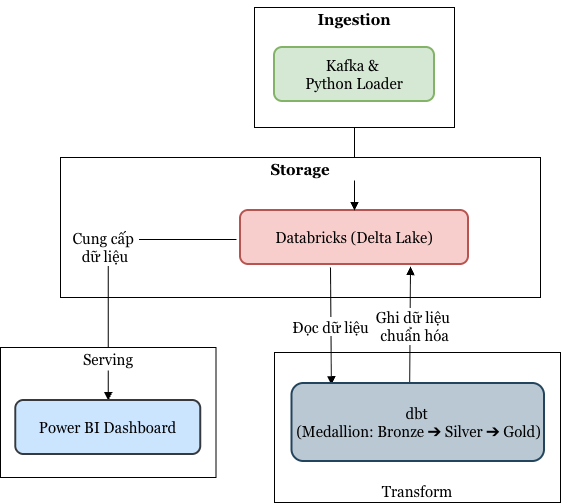

# Cosmetics Data Platform

## Tổng quan dự án

Đây là nền tảng kỹ thuật dữ liệu (Data Platform) chuyên sâu dành cho sàn thương mại điện tử mỹ phẩm, được thiết kế để xử lý luồng dữ liệu thời gian thực và phân tích chuyên sâu. Hệ thống áp dụng kiến trúc **Medallion (Bronze/Silver/Gold)** trên nền tảng **Delta Lake & Unity Catalog**, cho phép xử lý hơn 12 triệu dòng dữ liệu sự kiện với độ tin cậy và khả năng mở rộng cao.

## Kiến trúc hệ thống

Hệ thống tuân thủ nguyên tắc Idempotent trong mọi tầng xử lý, đảm bảo dữ liệu không bị trùng lặp khi chạy lại pipeline:

## Medallion Architecture

### 1. Ingestion

* **Công nghệ:** Go Producer (đọc CSV) → Kafka Topic (`ecommerce_events`) → Python Loader.
* **Điểm mạnh:** Sử dụng cơ chế *Exact-once* thông qua việc commit offset Kafka sau khi đã upload file thành công lên Databricks Volume. Cơ chế checkpoint giúp pipeline có thể tiếp tục xử lý (resumable) nếu xảy ra sự cố.

### 2. Storage & Transformation (dbt-databricks)

Chúng tôi sử dụng `dbt-databricks` kết nối qua Serverless SQL Warehouse để thực thi các phép biến đổi (transformations) trực tiếp trong Delta Lake.

* **Bronze (`bronze_cosmetics`):** Landing dữ liệu thô. Sử dụng `COPY INTO` kết hợp với `MERGE insert-only` dựa trên `_row_hash` (sinh từ `surrogate_key`) để đảm bảo không trùng lặp dữ liệu. Các bản ghi lỗi/rác được cách ly vào schema `quarantine`.
* **Silver (`silver_cosmetics`):** Làm sạch và chuẩn hóa. Thực hiện lọc Bot (user > 100 event/session) và Spam sessions, chuẩn hóa các cột `brand`, `price`, và phân loại `category`.
* **Gold (`gold_cosmetics`):** Mô hình hóa Star Schema (3 Dim, 3 Fact):
* `dim_product` (SCD1): Lưu thông tin sản phẩm mới nhất.
* `dim_user_snapshot` (SCD2): Lưu lịch sử biến động phân khúc người dùng (VIP, Newbie, Regular) thông qua Snapshot strategy của dbt.
* `fact_user_funnel`: Phân tích phễu chuyển đổi (View -> Cart -> Purchase).

## Công cụ kỹ thuật

* **Orchestration:** Apache Airflow (`cosmetics_medallion` DAG) với lịch chạy định kỳ 5 phút/lần.
* **Data Quality:** Hệ thống tích hợp sẵn **30 tests** (unique, not_null, relationships, accepted_values) chạy ngay sau mỗi model.
* **Governance:** Toàn bộ bảng được quản lý bằng **Unity Catalog**, tự động tạo lineage và quản lý phân quyền.

## Serving

Dữ liệu tại tầng Gold là nguồn tin cậy duy nhất cho các dashboard **Power BI**, phục vụ các bài toán kinh doanh trọng yếu:

* Phân tích GMV (Tổng giá trị giao dịch) theo Brand/Category.
* Phân tích hành vi phễu chuyển đổi khách hàng.
* Phân khúc khách hàng VIP/Tiềm năng theo mô hình RFM.
